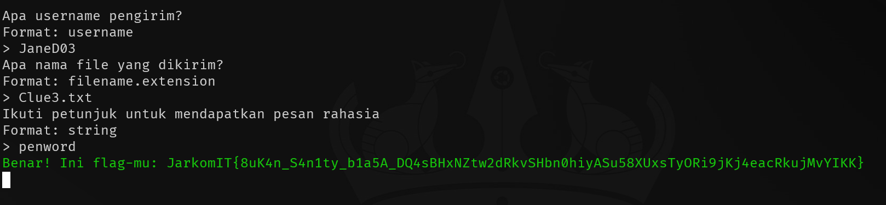
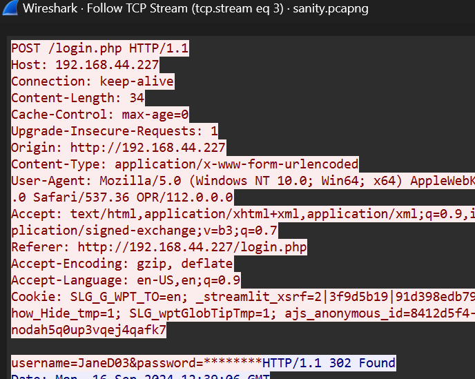
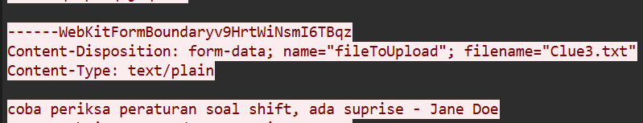
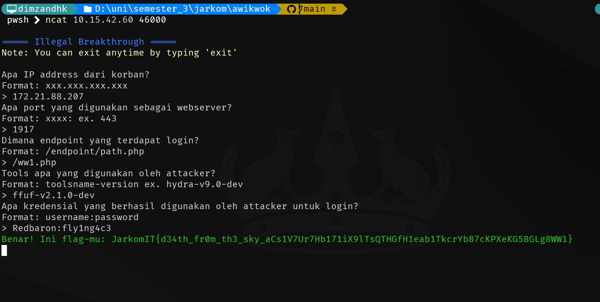
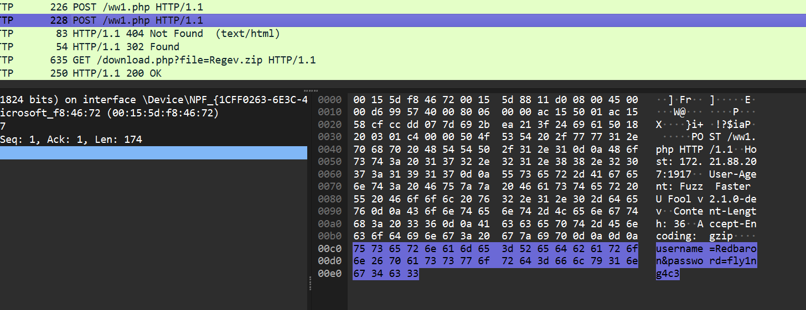
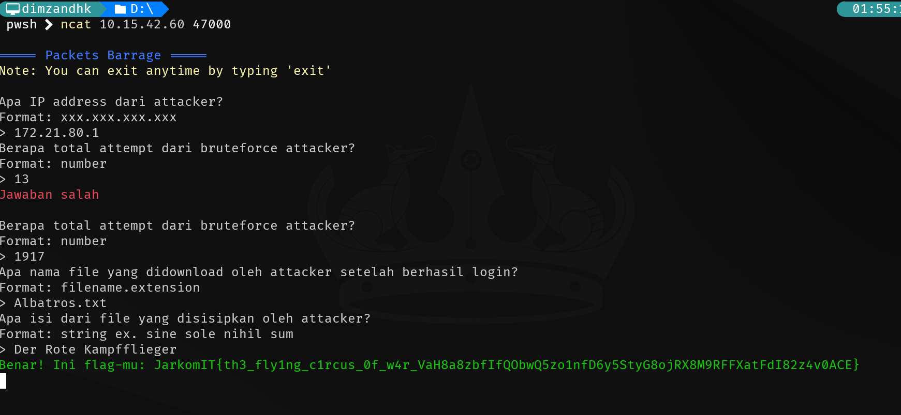

# Jarkom Modul 1 2024 IT07
- Dimas Andhika Diputra 5027231074
- Kharisma Fahrun Nisa 5027231086?

## Challenge Advance Sanity Check

Untuk mendapatkan pertanyaan pertama saya mendapatkannya dari packet tcp stream ke 3, ada username JaneD03 tetapi tanpa password

Untuk mendapatkan nama file yang dikirim ada di tcp stream ke 4

Lalu yang terakhir sesuai petunjuk di stream ke 4, kita diminta untuk cek peraturan praktikum di nomor 7 terdapat base64, lalu saya decode dari `cGVud29yZA==` menjadi `penword` lalu dapat flag

## Challenge Illegal Breakthrough

Untuk mendapatkan ip, port, dan endpoint ada di setiap packet tcp, untuk endpointnya merupakan endpoint untuk login dengan metode POST:

```
POST /ww1.php HTTP/1.1
Host: 172.21.88.207:1917
User-Agent: Fuzz Faster U Fool v2.1.0-dev
Content-Length: 36
Accept-Encoding: gzip
```

Untuk tools yang dipakai saya liat dari user agentnnya yaitu Fuzz Faster U Fool,

```
POST /ww1.php HTTP/1.1
Host: 172.21.88.207:1917
User-Agent: Fuzz Faster U Fool v2.1.0-dev
Content-Length: 36
Accept-Encoding: gzip
```

Untuk mendapatkan kredensialnya saya cari yang response dari postnya berupa response dengan kode 302 Found


## Challenge Packets Barrage


- IP address attacker didapat dari IP source yang melakukan POST ke /ww1.php
- Untuk total attempt saya mengecek manual dan didapatkan angka 1917
- Untuk nama file dan isinya saya dapatkan dari packet selanjutnya di stream ke 1918:

```
PK..
.....J.0Yz_..............Albatros.txtUT	..+ .fa .fux.............Der Rote Kampfflieger
PK....
.....J.0Yz_............................Albatros.txtUT...+ .fux.............PK..........R...\.....
```

## Challenge 

## Challenge