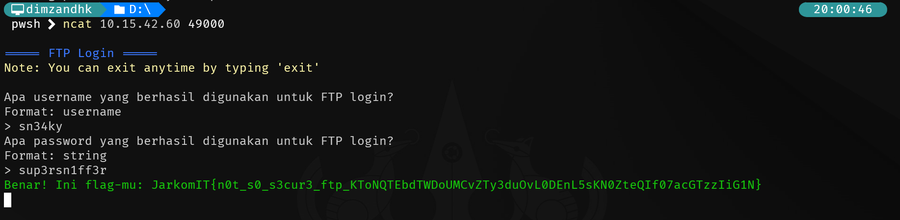
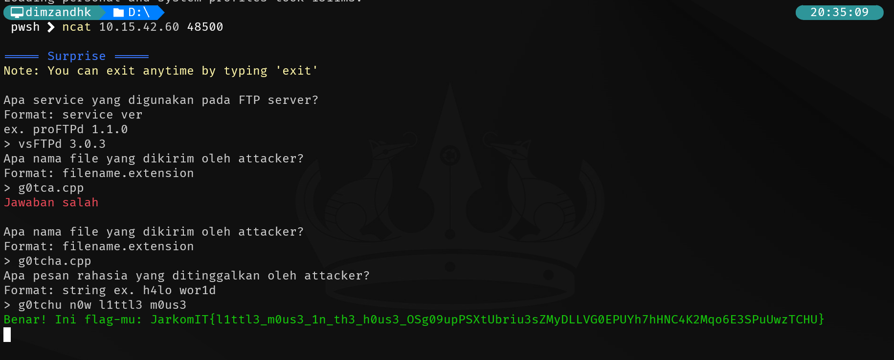
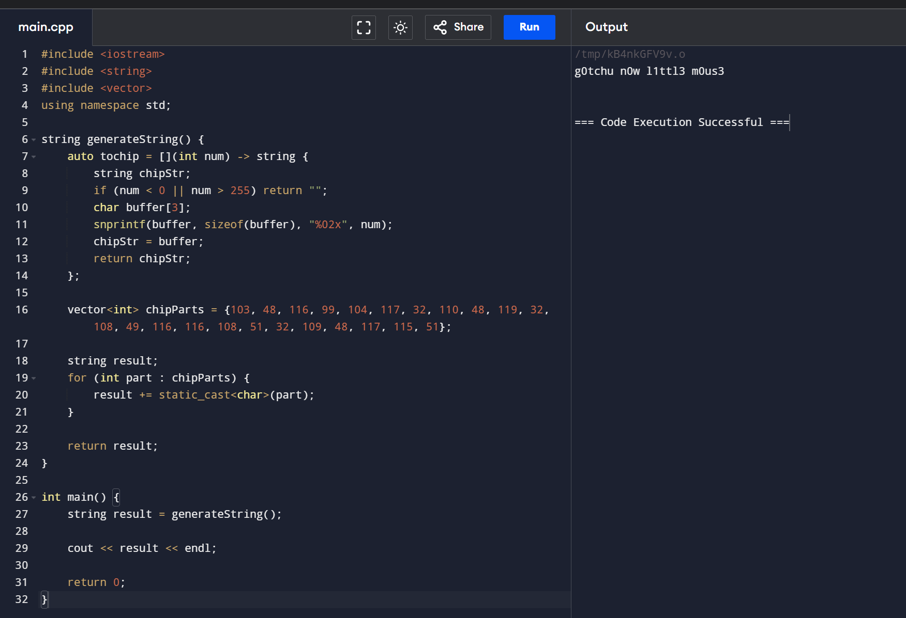
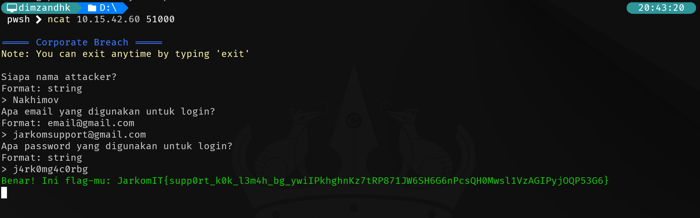

# Jarkom Modul 1 2024 IT07
- Dimas Andhika Diputra 5027231074
- Kharisma Fahrun Nisa 5027231086?

## Challenge Advance Sanity Check

Untuk mendapatkan pertanyaan pertama saya mendapatkannya dari packet tcp stream ke 3, ada username JaneD03 tetapi tanpa password

Untuk mendapatkan nama file yang dikirim ada di tcp stream ke 4

Lalu yang terakhir sesuai petunjuk di stream ke 4, kita diminta untuk cek peraturan praktikum di nomor 7 terdapat base64, lalu saya decode dari `cGVud29yZA==` menjadi `penword` lalu dapat flag

## Challenge Illegal Breakthrough

Untuk mendapatkan ip, port, dan endpoint ada di setiap packet tcp, untuk endpointnya merupakan endpoint untuk login dengan metode POST:

```
POST /ww1.php HTTP/1.1
Host: 172.21.88.207:1917
User-Agent: Fuzz Faster U Fool v2.1.0-dev
Content-Length: 36
Accept-Encoding: gzip
```

Untuk tools yang dipakai saya liat dari user agentnnya yaitu Fuzz Faster U Fool,

```
POST /ww1.php HTTP/1.1
Host: 172.21.88.207:1917
User-Agent: Fuzz Faster U Fool v2.1.0-dev
Content-Length: 36
Accept-Encoding: gzip
```

Untuk mendapatkan kredensialnya saya cari yang response dari postnya berupa response dengan kode 302 Found


## Challenge Packets Barrage


- IP address attacker didapat dari IP source yang melakukan POST ke /ww1.php
- Untuk total attempt saya mengecek manual dan didapatkan angka 1917
- Untuk nama file dan isinya saya dapatkan dari packet selanjutnya di stream ke 1918:

```
PK..
.....J.0Yz_..............Albatros.txtUT	..+ .fa .fux.............Der Rote Kampfflieger
PK....
.....J.0Yz_............................Albatros.txtUT...+ .fux.............PK..........R...\.....
```

## Challenge Pegawai Negeri Sebelah

Semua jawaban pertanyaan didapatkan dari data di tcp stream 1

```
Nama,Password,Jabatan
Cici Mustofa,Lq3o5UYh9X,Kepala Subbagian
Damu Widiastuti,^@zFc4ZtTj,Staf Keuangan
"Queen Thamrin, S.Gz",yR3h9H*ppR,Kepala Subbagian
"Hilda Purnawati, M.Kom.",A1$4hKx%MR,Analis Kebijakan
Luthfi Habibi,go6QNL22#U,Kepala Subbagian
Slamet Sirait,^^%yRMMf!b,Kepala Bidang
"Kawaca Wulandari, M.M.",7bP4*QzSQE,Staf Administrasi
Chelsea Agustina,TyYtjQ%^be,Pengawas Lapangan
Ira Andriani,#qn9ACbsJ0,Staf Keuangan
Yani Wibowo,qBOwJE@0du,Kepala Bidang
Tgk. Kani Saptono,GNNjHABAUX,Kepala Subbagian
..................
```

## Challenge EZ

untuk jawaban ada di tcp stream 0, dan portnya Transmission Control Protocol, Src Port: 36199, Dst Port: 1234, Seq: 0, Len: 0 merupakan dest port yang dituju

## Challenge Rizzset

Untuk domain pada log muncul url its:

`.............www.its.ac.id......w...........www.its.ac.id.....`

dan untuk mendapatkan ipnya saya lakukan ping ke domain tersebut:

```
pwsh  ping www.its.ac.id

Pinging www.its.ac.id [103.94.189.5] with 32 bytes of data:
Reply from 103.94.189.5: bytes=32 time=60ms TTL=61
Reply from 103.94.189.5: bytes=32 time=101ms TTL=61
```

terakhir untuk mendapatkan JARM fingerprint dari domain its, saya menggunakan tools dari github yang saya temukan di internet dan hasilnya sebagai berikut:

```
pwsh  python .\jarm.py -i .\alexa500.txt
Domain: www.its.ac.id
Resolved IP: 103.94.189.5
JARM: 2ad2ad16d2ad2ad22c2ad2ad2ad2ad74aaecca9f9c4a3303863dfee62b241e
```

## Challenge Stegography


untuk berapa banyak gambar yang dikirim saya mendapatkannya dari save semua gambar yang didapat dari response


lalu setelah itu saya ubah sedikit kode pythonnya agar cara menjalankannya tidak dengan mengubah path gambar langsung di kode melainkan lewat argument yang diberi ketika menjalankan kode pythonnya itu sendiri


didapat dari hasil tersebut yang mengandung info adalah ATP.png, EH.png, dan KJK.png

## Challenge FTP login

Untuk semua pertanyaan ada di tcp stream ke 4 di mana terdapat log user dan password saat sukses login

```
220 (vsFTPd 3.0.3)
OPTS UTF8 ON
200 Always in UTF8 mode.
USER orange
331 Please specify the password.
PASS heather
530 Login incorrect.
USER nicole
331 Please specify the password.
PASS ginger
530 Login incorrect.
USER sn34ky
331 Please specify the password.
PASS sup3rsn1ff3r
230 Login successful.
PORT 172,21,80,1,253,130
200 PORT command successful. Consider using PASV.
STOR g0tcha.cpp
150 Ok to send data.
226 Transfer complete.
QUIT
221 Goodbye.
```

## Challenge Surprise

untuk pertanyaan pertama dan kedua masih didapat dari tcp stream 4

```
220 (vsFTPd 3.0.3)
OPTS UTF8 ON
200 Always in UTF8 mode.
USER orange
331 Please specify the password.
PASS heather
530 Login incorrect.
USER nicole
331 Please specify the password.
PASS ginger
530 Login incorrect.
USER sn34ky
331 Please specify the password.
PASS sup3rsn1ff3r
230 Login successful.
PORT 172,21,80,1,253,130
200 PORT command successful. Consider using PASV.
STOR g0tcha.cpp
150 Ok to send data.
226 Transfer complete.
QUIT
221 Goodbye.
```

untuk pertanyaan ke 3, pada stream tcp 5 terdapat file c++ yang mana jika dijalankan akan menghasilkan:



## Challenge Corporate Breach

Untuk pertanyaan pertama ada di tcp stream 0

```
POST / HTTP/1.1
Host: 172.21.88.207
User-Agent: curl/8.8.0
Accept: */*
Content-Length: 127
Content-Type: application/x-www-form-urlencoded

Hello, my name is Nakhimov and I'm here trying to get in to your system. I'm sorry, but your system is too weak for me. I'm in.HTTP/1.1 404 Not Found
Server: nginx/1.26.0
Date: Wed, 18 Sep 2024 04:08:27 GMT
Content-Type: text/html
Content-Length: 153
Connection: keep-alive

<html>
<head><title>404 Not Found</title></head>
<body>
<center><h1>404 Not Found</h1></center>
<hr><center>nginx/1.26.0</center>
</body>
</html>
```

dan untuk 2 pertanyaan terakhir saya cek manual yang POST ke index.php nya tidak ada response invalid password yaitu tcp stream 207

```
POST /index.php HTTP/1.1
Host: 172.21.88.207:800
User-Agent: python-requests/2.32.3
Accept-Encoding: gzip, deflate
Accept: */*
Connection: keep-alive
Content-Length: 54
Content-Type: application/x-www-form-urlencoded

email=jarkomsupport%40gmail.com&password=j4rk0mg4c0rbgHTTP/1.1 200 OK
Host: 172.21.88.207:800
Date: Wed, 18 Sep 2024 04:09:14 GMT
Connection: close
X-Powered-By: PHP/8.2.21
Set-Cookie: PHPSESSID=994a8fjscc6fn8pmrigbgmraol; path=/
Expires: Thu, 19 Nov 1981 08:52:00 GMT
Cache-Control: no-store, no-cache, must-revalidate
Pragma: no-cache
Refresh: 2; URL=upload.php
Content-type: text/html; charset=UTF-8
```


